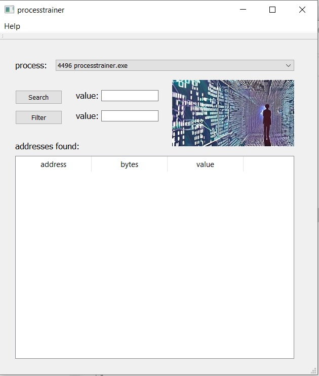

# processtrainer

a simple minimalist trainer for values of addresses of a process.    
you can use it for example for cheating in games ;-)    
release: windows 10, 64bit, release, version 0.1    

screenshot:    

     

# contact:
sys_temerror at web dot de    

